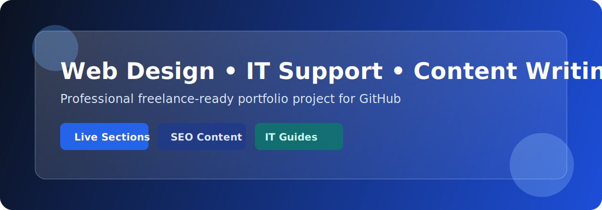
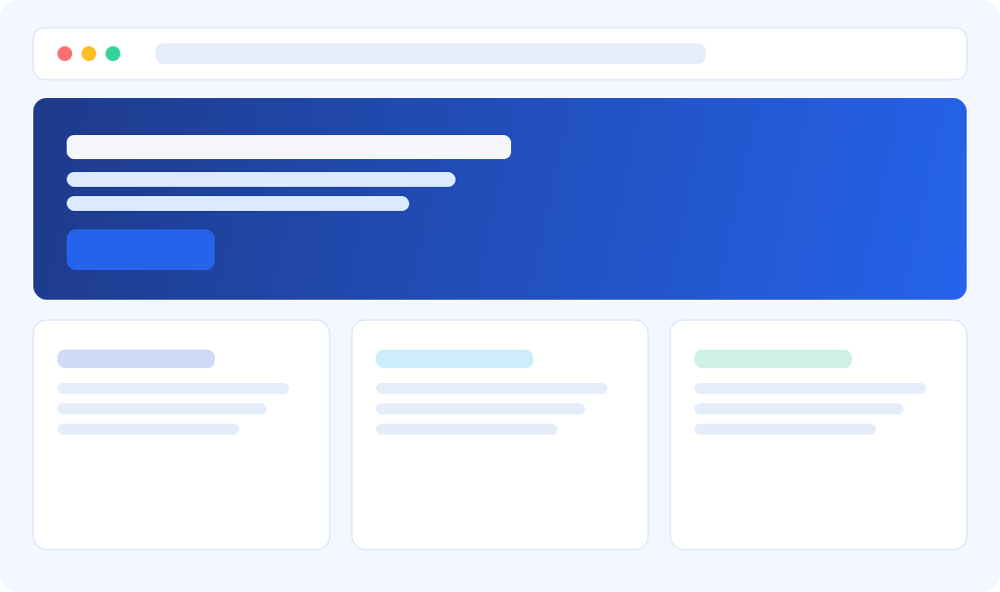

# 🌐 Web Design, IT Support, and Content Writing Portfolio



A complete, GitHub-ready portfolio project for freelancers and entry-level professionals who want to showcase **web design**, **IT support**, and **SEO content writing** in one polished repository.

---

## ✨ Project Highlights

- Modern, responsive one-page portfolio website
- Clean section-based layout: **Home, About, Services, Portfolio Projects, Contact**
- Interactive JavaScript features for a better user experience
- Professional IT support documentation for practical troubleshooting
- SEO-focused content writing sample suitable for client work
- Beginner-friendly file organization and readable code/comments



---

## 🧩 Features

### Frontend Website
- Fully responsive HTML/CSS layout
- Smooth, minimal design suitable for freelance branding
- Sticky navigation with mobile hamburger menu
- Contact form with client-side validation feedback

### IT Support Documentation
- Common network troubleshooting workflow
- System error diagnosis checklist
- Escalation-ready documentation format
- Operational best practices for support teams

### Content Writing Sample
- SEO-friendly article structure
- Clear headings and skimmable format
- Professional tone appropriate for B2B/business websites

---

## 🛠️ Technologies Used

- **HTML5**
- **CSS3**
- **JavaScript (Vanilla JS)**
- **Markdown**

---

## 📁 Project Structure

```text
portfolio-project/
├── index.html
├── style.css
├── script.js
├── README.md
├── assets/
│   ├── portfolio-banner.svg
│   └── project-preview.svg
├── content/
│   └── blog_sample.md
└── docs/
    └── IT_support_guide.md
```

---

## ▶️ Sample Video Walkthrough

> A sample portfolio walkthrough video you can use as a demo placeholder in GitHub.

[](https://www.youtube.com/watch?v=3JluqTojuME)

**Direct link:** https://www.youtube.com/watch?v=3JluqTojuME

---

## 🚀 How to Run the Project

### Option 1: Open directly
1. Clone or download this repository.
2. Navigate to the `portfolio-project` folder.
3. Open `index.html` in your browser.

### Option 2: Run a local server (recommended)

```bash
cd portfolio-project
python3 -m http.server 8000
```

Then open: `http://localhost:8000`

---

## 👤 Author

**Alex Carter**  
Freelance Web Designer • IT Support Specialist • Content Writer

---

## 📌 License

This project is open for educational and portfolio use. You can customize it for personal freelance branding.
